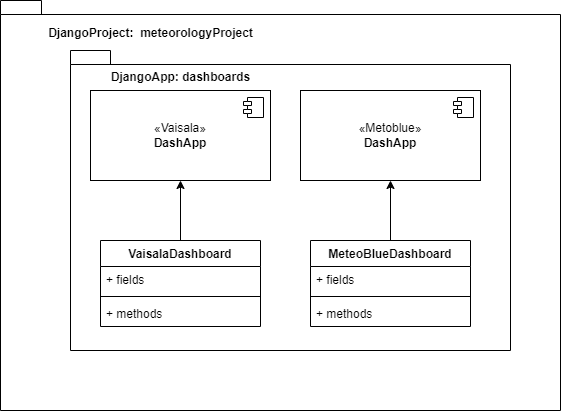
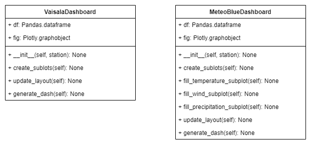

<br>
<br>
<br>


# LCO Meteorology

This project displays the meteorology data obtained from 2 sources: **Vaisala** and 
**Meteoblue**, this data is obtained using **lcodataclient module** which returns the 
information in a pandas dataframe. The data is displayed in dashboards using: 
Django, Dash and Ploty. To integrate all of these 3 technologies the project uses **django_plotly_dash**. All of this is done following the OOP paradigm, PEP 8 and the folder structures that Django gives.

<p align="center">
  <a href="#how-it-works">How it works •</a>
  <a href="#getting-started">Getting Started</a> •
  <a href="#installing">Installing •</a>   
  <a href="#satellite-script">Satellite Script •</a>
  <a href="#dash-gif-component">Dash Gif Component •</a>
  <a href="#built-with">Built with </a>
</p>

## How it works
1. Creates django project: The whole application lives in a Django project
2. Create django app: There is only one app which is the **dashboards** folder
3. Creates dash apps inside django app: Inside the app there is 2 dash apps
one for the Vaisala and the other for the Meteoblue dashboard.
4. Dash apps are called within the django views: The apps are rendered usign 
the django views. For more info in django views check [this](https://docs.djangoproject.com/en/5.0/intro/tutorial01/#write-your-first-view).

- In a nutshell the project structure is like this: 

<p align="center">
  
</p>

5. Each dashboard is a class and each plot is a function: The classes are the
followings

<p align="center">
  
</p>

## Getting Started

First you will need to create a python virtual enviroment and then install 
the requirements.txt to finally start the project in your local machine

### Prerequisites

The main libraries of this project are:
- django_plotly_dash
- dash
- plotly

 ``` bash
# First create virtual enviroment
$ python3 -m venv venv

# Second activate the virtual enviroment (Ubuntu)
$ source venv/bin/activate

# Install the requirements in the virtual enviroment
$ python3 install -r requirements.txt
```

### Installing

After you have all the libraries installed you can start the project in your 
local machine.

``` bash
# First go to the django project folder
$ cd ./meteorologyProject

# Second start the local server
$ python3 manage.py runserver
```

## Satellite Script

This application also handles the creation of a gif to display satellital data of the weather around
Chile. This script can create the gif every certain amount of time, this is achieved by using celery.

To accomplish this the app uses celery beat who acts as broker for invoking the script when defined.

Once the Django app is up you can start the **worker** with the following:

``` bash
# Start the celery worker
$ celery -A meteorologyProject worker -l info
```

Now you can start the **broker** for invoking the script:

``` bash
# Start the celery broker
$ celery -A meteorologyProject beat -l info -S django_celery_beat.schedulers:DatabaseScheduler
```

It is important that in `settings.py` you have the configuration with the following structure:

``` bash
# Celery settings
CELERY_BROKER_URL = "redis://127.0.0.1:6379/0"
CELERY_TIMEZONE = TIME_ZONE
CELERY_RESULT_BACKEND = 'django-db'
CELERY_RESULT_EXTENDED = True

# Celery Beat settings
CELERY_BEAT_SCHEDULER = "django_celery_beat.schedulers:DatabaseScheduler"

CELERY_BEAT_SCHEDULE = {
     'create_gif':{
         'task':'dashboards.tasks.create_gif',
         'schedule': 120 # Sets the script to be invoked every 120 seconds
         }
}
``` 

Regarding the script, it basically uses web-scraping for downloading images from a public site, converts
them in a gif and finally stores it in the app.

The script also saves the downloaded images in folders but only allowing "x" amount of folders which can be setted in `config.ini`. 

For more information regarding the functionality of the script check: [Python Script](https://github.com/gabrielcarvajalfigueroa/Satellite_gifmaker/blob/main/main.py)

## Dash Gif Component

For adding the functionality of having a Gif that you can pause and play this app uses a custom dash component
which is called Gif Player, essentially it borrows the existing [react-gif-player](https://github.com/benwiley4000/react-gif-player) and then converts it into a 
python class so it can be called within `meteorology_subplots.py` like this:

``` bash
html.Div([
          gif.GifPlayer( 
              id='satanim',
              gif= app.get_asset_url('satanim.gif'),
              still= app.get_asset_url('20240201220.png')
      )
      ], style={'grid-column-start': '3', 'grid-row-start': '1', 'grid-row-end': '3'}),
```

[This component](https://github.com/mbkupfer/dash-gif-component) was not created by me, but I had to add the `id` attribute otherwise you can not call it in a 
callback. For adding this I had to recreate the custom component following [Dash Custom Components](https://dash.plotly.com/react-for-python-developers).

If you want to check more about the changes I made to the component here: [Dash-Gif-Player](https://github.com/gabrielcarvajalfigueroa/Dash-Gif-Player).

## Built With

* [Django](https://www.djangoproject.com/) - The web framework used.
* [django_plotly_dash](https://django-plotly-dash.readthedocs.io/en/latest/) - 
Plotly Dash applications served up in Django templates using tags.
* [Dash](https://dash.plotly.com/) - Framework for build data apps.
* [Plotly](https://plotly.com/) - Used to generate the graphs.
* [lcodataclient]() - Module for obtaining the data in dataframes.
* [Pandas](https://pandas.pydata.org/) - Used to manipulate the dataframes.
* [Celery](https://docs.celeryq.dev/en/stable/django/first-steps-with-django.html) - Used for task scheduling


## Author

* **Gabriel Carvajal Figueroa** - *Initial work* - [Github](https://github.com/gabrielcarvajalfigueroa)


## Acknowledgments

* Thank to Nicolas Gonzalez for developing the lcodataclient module.
