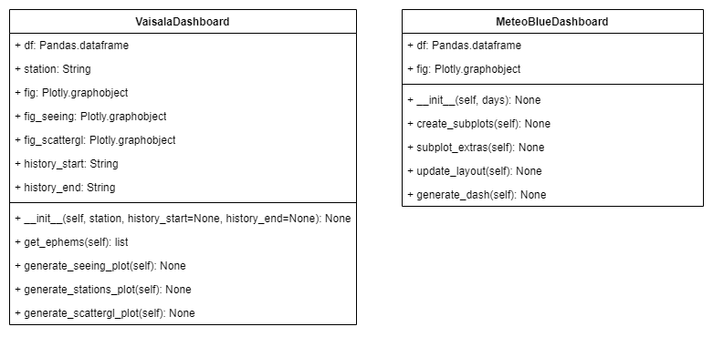

<br>
<br>
<br>


# LCO Meteorology

This project displays the meteorology data obtained from 2 sources: **Vaisala** and 
**Meteoblue**, this data is obtained using **lcodataclient module** which returns the 
information in a pandas dataframe. The data is displayed in dashboards using: 
Django, Dash and Ploty. To integrate all of these 3 technologies the project uses **django_plotly_dash**. All of this is done following the OOP paradigm, PEP 8 and the folder structures that Django gives.

<p align="center">
  <a href="#how-it-works">How it works </a> •
  <a href="#flow-for-rendering-djangodash">Flow for Rendering DjangoDash</a> •  
  <a href="#installing">Installing </a> •
  <a href="#dash-gif-component">Dash Gif Component </a> •
  <a href="#project-structure">Project Structure </a> •
  <a href="#getting-started">Getting Started</a> •
  <a href="#built-with">Built with </a> 
</p>

## How it works
1. Creates django project: The whole application lives in a Django project
2. Create django app: There is only one app which is the **dashboards** folder
3. Creates dash apps inside django app: Inside the app there is 2 dash apps
one for the Vaisala and the other for the Meteoblue dashboard.
4. Dash apps are called within the django views: The apps are rendered usign 
the django views. For more info in django views check [this](https://docs.djangoproject.com/en/5.0/intro/tutorial01/#write-your-first-view).

- In a nutshell the project structure is like this: 

<p align="center">
  
</p>

5. Each dashboard is a class and each graph is a function: The classes are the
followings

<p align="center">
  
</p>

## Flow for Rendering DjangoDash

<p align="center">
  
</p>

### Classes

The previous classes that were showed both exist in the `dashboards_components.py` and both have the logic
to render their respective plot

### DjangoDashApps

The class is instantiated in a callback and then is passed via output to the `dcc.Graph` which is a component
that can receive a plotly figure for rendering it
``` python
# Callback for updating meteoblue plot
@app.callback(
               Output('meteoblue_plot', 'figure'), #id of html component
              [Input('days', 'value')]) #id of html component
              
def update_value(*args,**kwargs):
    """
    This function returns Meteoblue figure according to the days selected
    the first time renders with 4 days
    Input: days selected
    Output: Meteoblue Figure Object
    """
    # args[0] = 1 days
    # args[0][:1] = 1

    df = MeteoBlueDashboard(args[0][:1])
    
    df.generate_dash()

    return df.fig
``` 
### HTML

Renders the django dash app:

``` html
<!-- Renders plotly app with Meteoblue data-->
<!-- It's neccesary to add the the container_iframe to 
    ensure that the plotly app will fully display-->

<div id="container_iframe">
    
</div>

<style>
    #container_iframe div{
        height: 780px!important  ;
    }
</style>
```

### DjangoView

Sends the html to the end user via HttpResponse:

``` python
# ----------------- View for Vaisala Dashboard ------------------------ #
def dashboards(request):

    template = loader.get_template("index.html")    

    context = {'data' : ''}
    
    return HttpResponse(template.render(context, request))
```


## Dash Gif Component

For adding the functionality of having a Gif that you can pause and play this app uses a custom dash component
which is called Gif Player, essentially it borrows the existing [react-gif-player](https://github.com/benwiley4000/react-gif-player) and then converts it into a 
python class so it can be called within `meteorology_subplots.py` like this:

``` bash
html.Div([
          gif.GifPlayer(
          id= 'redanim',                                    
          gif=  "https://clima.lco.cl/casca/redanim.gif?3588110",
          still= "https://clima.lco.cl/casca/latestred.png",    
          height = 340,                                
          width = 340
)], style={'grid-column-start': '2', 'grid-row-start': '3', 'margin-left': 'auto', 'margin-right': 'auto'}),
```

To use this package do:
```
(venv) $ pip install gif-player
```

And do not forget to reference it in your `settings.py`:

``` py
. . .

#Add PLOTLY_COMPONENTS
PLOTLY_COMPONENTS = [
    'dash_core_components',
    'dash_html_components',
    'dash_renderer',
    'dpd_components',
    'dpd_static_support',
    'gif_player'] <---- Here you include it

. . .
```

[This component](https://github.com/mbkupfer/dash-gif-component) was not created by me, but I had to add the `id` attribute otherwise you can not call it in a 
callback. For adding this I had to recreate the custom component following [Dash Custom Components](https://dash.plotly.com/react-for-python-developers).

If you want to check more about the changes I made to the component here: [Dash-Gif-Player](https://github.com/gabrielcarvajalfigueroa/Dash-Gif-Player).

## Project Structure
```
├── README.md
├── img                                   # Folder that contains imgs for README
│   
├── meteorologyProject                    # Django Project
│   ├── celerybeat-schedule
|   │   ├── dashboards                    # Django App
│   │   ├── Dash_Apps
│   │   │   ├── dashboards_components.py  # Contains classes for rendering plots
│   │   │   ├── history_subplots.py       # Creates DjangoDash subplots for history data
│   │   │   ├── meteoblue_subplots.py     # Creates DjangoDash for meteoblue
│   │   │   └── meteorology_subplots.py   # Creates DjangoDash for stations data
│   │   ├── __init__.py
│   │   ├── admin.py
│   │   ├── apps.py
│   │   ├── migrations
│   │   ├── models.py
│   │   ├── templates                     # Contains html files for the views 
│   │   │   ├── allskycamera.html
│   │   │   ├── history.html
│   │   │   ├── index.html
│   │   │   ├── meteoblue.html
│   │   │   ├── navbar.html
│   │   │   ├── nightlyskymovie.html
│   │   │   ├── otherResources.html
│   │   │   └── webcams.html
│   │   ├── tests.py
│   │   ├── urls.py                       # Maps urls using the views
│   │   └── views.py                      # Uses HttpResponse for render html files
│   ├── db.sqlite3
│   ├── logs.log
│   ├── manage.py
│   └── meteorologyProject                # Project subfolder
│       ├── __init__.py
│       ├── asgi.py
│       ├── settings.py
│       ├── urls.py
│       └── wsgi.py
└── requirements.txt
```

## Getting Started

First you will need to create a python virtual enviroment and then install 
the requirements.txt to finally start the project in your local machine

### Prerequisites

The main libraries of this project are:
- django_plotly_dash
- dash
- plotly

 ``` bash
# First create virtual enviroment
$ python3 -m venv venv

# Second activate the virtual enviroment (Ubuntu)
$ source venv/bin/activate

# Install the requirements in the virtual enviroment
$ python3 install -r requirements.txt
```

### Installing

After you have all the libraries installed you can start the project in your 
local machine.

``` bash
# First go to the django project folder
$ cd ./meteorologyProject

# Second start the local server
$ python3 manage.py runserver
```

## Built With

* [Django](https://www.djangoproject.com/) - The web framework used.
* [django_plotly_dash](https://django-plotly-dash.readthedocs.io/en/latest/) - 
Plotly Dash applications served up in Django templates using tags.
* [Dash](https://dash.plotly.com/) - Framework for build data apps.
* [Plotly](https://plotly.com/) - Used to generate the graphs.
* [lcodataclient]() - Module for obtaining the data in dataframes.
* [Pandas](https://pandas.pydata.org/) - Used to manipulate the dataframes.


## Author

* **Gabriel Carvajal Figueroa** - *Initial work* - [Github](https://github.com/gabrielcarvajalfigueroa)


## Acknowledgments

* Thank to Nicolas Gonzalez for developing the lcodataclient module.
